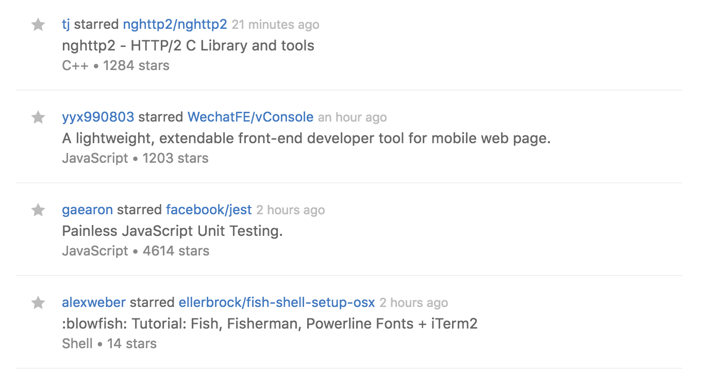

# showcasify
> A Chrome extension that adds the description and the number of stars to starred, newly created, and forked repositories in the GitHub News Feed

## Installation
- Clone the repo
- Open Chrome Extensions chrome://extensions and enable developer mode
- Click on **Load Unpacked Extension** and select recently cloned repository folder

## TODO
- Emojis
- Icon/Logo
- Github OAauth
- Integrate with Redux
- Publish to Chrome Web Store

## License
MIT © [Philipp Alferov](https://github.com/alferov)
